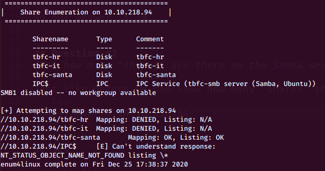

# Advent of cyber 2 | day 9 | Anyone can be Santa!

> Tal Baraz

-----

For me the ip for the machine was: `10.10.218.94` it'll probably be diffrent for you.

## Question #1
*Using enum4linux, how many users are there on the Samba server (10.10.218.94)?*

We can find out how many users are there on the Samba server with:
```bash
enum4linux -U 10.10.218.94
```
We get:


So we get 3 users:
- elfmcskidy
- elfmceager
- elfmcelferson

So our answer is `3`.

## Question #2
*Now how many "shares" are there on the Samba server?*

Just like before we can know how many "shares" there are with:
```bash
enum4linux -S 10.10.218.94
```

We get:



So we get 4 shares:
- tbfc-hr
- tbfc-it
- tbfc-santa
- IPC$

So our answer is `4`.

## Question #3
*Use smbclient to try to login to the shares on the Samba server (10.10.218.94). What share doesn't require a password?*

we can try login like this:
```bash
smbclient //10.10.218.94/{share-name}
```

And discovered that the share `tbfc-santa` doesn't require any password to access.
```
smbclient //10.10.218.94/tbfc-santa
```


So our answer of course is: `tbfc-santa`

## Question #4
*Log in to this share, what directory did ElfMcSkidy leave for Santa?*

Using `ls` we can see:


we see 2 files:
- jingle-tunes (dir) 
- note_from_mcskidy.txt

we can get the `note_from_mcskidy.txt` file like a so:
```bash
get note_from_mcskidy.txt
```

or just use:
```bash
more note_from_mcskidy.txt
```
To view it's content (press `q` to quit `more` )

And it's contents are:
```
Hi Santa, I decided to put all of your favourite jingles onto this share - allowing you access it from anywhere you like! Regards ~ ElfMcSkidy
```

From the `ls` we ran before we know the answer is: `jingle-tunes`