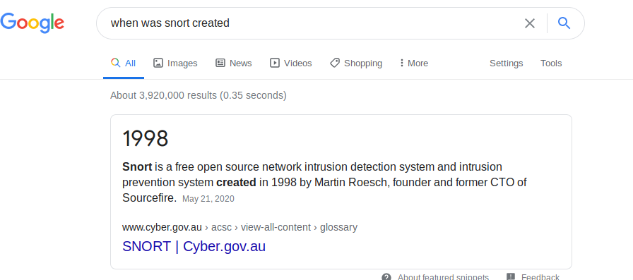
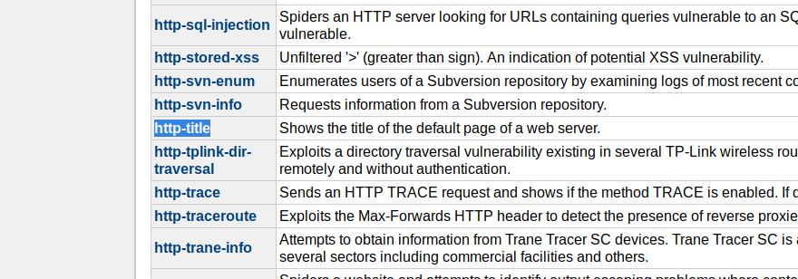

# Advent of cyber 2 | day 8 | What's Under the Christmas Tree?

> Tal Baraz

-----

For me the ip for the machine was: `10.10.18.225` it'll probably be diffrent for you.

## Question 1
*When was Snort created?*

A quick google search get us the answer:


So our answer is `1998`

## Question 2
*Using Nmap on 10.10.18.225 , what are the port numbers of the three services running?  (Please provide your answer in ascending order/lowest -> highest, separated by a comma)*

Doing a simple nmap scan to all the ports and outputing our results at `nmap/all_ports`:
```bash
nmap 10.10.18.225 -oN nmap/normal
```

- Note: it's probably better to add the `-p-` flag to scan all the ports but I didn't because it takes alot of time and luckily we needed too.

The results from the scan are:
```
Starting Nmap 7.80 ( https://nmap.org ) at 2020-12-25 08:56 EST
Nmap scan report for 10.10.18.225
Host is up (0.10s latency).
Not shown: 997 closed ports
PORT     STATE SERVICE
80/tcp   open  http
2222/tcp open  EtherNetIP-1
3389/tcp open  ms-wbt-server

Nmap done: 1 IP address (1 host up) scanned in 17.93 seconds
```

We can see 3 open ports:
- 80
- 2222
- 3389

So our answer is `80,2222,3389`

## Question 3
*Run a scan and provide the -Pn flag to ignore ICMP being used to determine if the host is up*

We would run:
```bash
nmap 10.10.18.225 -Pn
```

```
No answer needed
```

## Question 4
*Experiment with different scan settings such as-A and -sV whilst comparing the outputs given.*

Running both flags like a so:

### Version fingerprinting
```bash
nmap 10.10.18.225 -sV -oN nmap/version_detection
```

Results:

```
Starting Nmap 7.80 ( https://nmap.org ) at 2020-12-25 09:05 EST
Nmap scan report for 10.10.18.225
Host is up (0.11s latency).
Not shown: 997 closed ports
PORT     STATE SERVICE       VERSION
80/tcp   open  http          Apache httpd 2.4.29 ((Ubuntu))
2222/tcp open  ssh           OpenSSH 7.6p1 Ubuntu 4ubuntu0.3 (Ubuntu Linux; protocol 2.0)
3389/tcp open  ms-wbt-server xrdp
Service Info: OS: Linux; CPE: cpe:/o:linux:linux_kernel

Service detection performed. Please report any incorrect results at https://nmap.org/submit/ .
Nmap done: 1 IP address (1 host up) scanned in 24.38 seconds
```

### Aggresive scan
```bash
nmap 10.10.18.225 -A -oN nmap/aggresive
```

Results:

```
Starting Nmap 7.80 ( https://nmap.org ) at 2020-12-25 09:05 EST
Nmap scan report for 10.10.18.225
Host is up (0.099s latency).
Not shown: 997 closed ports
PORT     STATE SERVICE       VERSION
80/tcp   open  http          Apache httpd 2.4.29 ((Ubuntu))
|_http-generator: Hugo 0.78.2
|_http-server-header: Apache/2.4.29 (Ubuntu)
|_http-title: TBFC&#39;s Internal Blog
2222/tcp open  ssh           OpenSSH 7.6p1 Ubuntu 4ubuntu0.3 (Ubuntu Linux; protocol 2.0)
| ssh-hostkey: 
|   2048 cf:c9:99:d0:5c:09:27:cd:a1:a8:1b:c2:b1:d5:ef:a6 (RSA)
|   256 4c:d4:f9:20:6b:ce:fc:62:99:54:7d:c2:b4:b2:f2:b2 (ECDSA)
|_  256 d0:e6:72:18:b5:20:89:75:d5:69:74:ac:cc:b8:3b:9b (ED25519)
3389/tcp open  ms-wbt-server xrdp
Service Info: OS: Linux; CPE: cpe:/o:linux:linux_kernel

Service detection performed. Please report any incorrect results at https://nmap.org/submit/ .
Nmap done: 1 IP address (1 host up) scanned in 92.55 seconds

```


As we can see the `aggresive` scan took way longer then the `version scan` however not only did it gave as the same information as the
 `version scan` it gave us way more information.
```
No answer needed
```

## Question 5
*Use Nmap to determine the name of the Linux distribution that is running, what is reported as the most likely distribution to be running?*

We just need to run this with the `-O` flag meaning OS-detecion and for OS scan it requires root privileges so I added `sudo` in front
```bash
sudo nmap 10.10.18.225 -O -oN nmap/os_detection
```

```
Starting Nmap 7.80 ( https://nmap.org ) at 2020-12-25 09:21 EST
Nmap scan report for 10.10.18.225
Host is up (0.098s latency).
Not shown: 997 closed ports
PORT     STATE SERVICE
80/tcp   open  http
2222/tcp open  EtherNetIP-1
3389/tcp open  ms-wbt-server
No exact OS matches for host (If you know what OS is running on it, see https://nmap.org/submit/ ).
TCP/IP fingerprint:
OS:SCAN(V=7.80%E=4%D=12/25%OT=80%CT=1%CU=37854%PV=Y%DS=2%DC=I%G=Y%TM=5FE5F5
OS:89%P=x86_64-pc-linux-gnu)SEQ(SP=103%GCD=1%ISR=108%TI=Z%CI=Z%II=I%TS=A)OP
OS:S(O1=M508ST11NW6%O2=M508ST11NW6%O3=M508NNT11NW6%O4=M508ST11NW6%O5=M508ST
OS:11NW6%O6=M508ST11)WIN(W1=F4B3%W2=F4B3%W3=F4B3%W4=F4B3%W5=F4B3%W6=F4B3)EC
OS:N(R=Y%DF=Y%T=40%W=F507%O=M508NNSNW6%CC=Y%Q=)T1(R=Y%DF=Y%T=40%S=O%A=S+%F=
OS:AS%RD=0%Q=)T2(R=N)T3(R=N)T4(R=Y%DF=Y%T=40%W=0%S=A%A=Z%F=R%O=%RD=0%Q=)T5(
OS:R=Y%DF=Y%T=40%W=0%S=Z%A=S+%F=AR%O=%RD=0%Q=)T6(R=Y%DF=Y%T=40%W=0%S=A%A=Z%
OS:F=R%O=%RD=0%Q=)T7(R=Y%DF=Y%T=40%W=0%S=Z%A=S+%F=AR%O=%RD=0%Q=)U1(R=Y%DF=N
OS:%T=40%IPL=164%UN=0%RIPL=G%RID=G%RIPCK=G%RUCK=G%RUD=G)IE(R=Y%DFI=N%T=40%C
OS:D=S)

Network Distance: 2 hops

OS detection performed. Please report any incorrect results at https://nmap.org/submit/ .
Nmap done: 1 IP address (1 host up) scanned in 32.30 seconds
```

Looks like nmap didn't recognize the distribution However from the version fingerprinting we did before we got the following line:
```
2222/tcp open  ssh           OpenSSH 7.6p1 Ubuntu 4ubuntu0.3 (Ubuntu Linux; protocol 2.0)
```

As we can see the version is: `OpenSSH 7.6p1 Ubuntu 4ubuntu0.3` thus meaning we are scaning an `Ubuntu Linux`

And so the distribution is of course `Ubuntu`

## Question 6
*Use Nmap's Network Scripting Engine (NSE) to retrieve the "HTTP-TITLE" of the webserver. Based on the value returned, what do we think this website might be used for?*

looking at https://nmap.org/nsedoc/

We find this:

We can issue the command:
```bash
nmap 10.10.18.225 --script http-title -T4 -oN nmap/http_title
```

- Note: I added the `-T4` flag to make this run a little be quicker

Results:
```
Starting Nmap 7.80 ( https://nmap.org ) at 2020-12-25 09:31 EST
Nmap scan report for 10.10.18.225
Host is up (0.11s latency).
Not shown: 997 closed ports
PORT     STATE SERVICE
80/tcp   open  http
|_http-title: TBFC&#39;s Internal Blog
2222/tcp open  EtherNetIP-1
3389/tcp open  ms-wbt-server

Nmap done: 1 IP address (1 host up) scanned in 12.71 seconds
```

We see that the title is: `TBFC&#39;s Internal Blog` and `&#39;` is html encode for `' (single qoute)` so the title is actually:
`TBFC's Internal Blog`

So we can understand that this is a `blog` we site, and that's our answer.

## Question 7
*Now use different scripts against the remaining services to discover any further information about them*

You can go a head and run this to get the results
```bash
nmap 10.10.18.225 --script vuln -T4 -oN nmap/vuln_scan
```

```
No answer need
```
